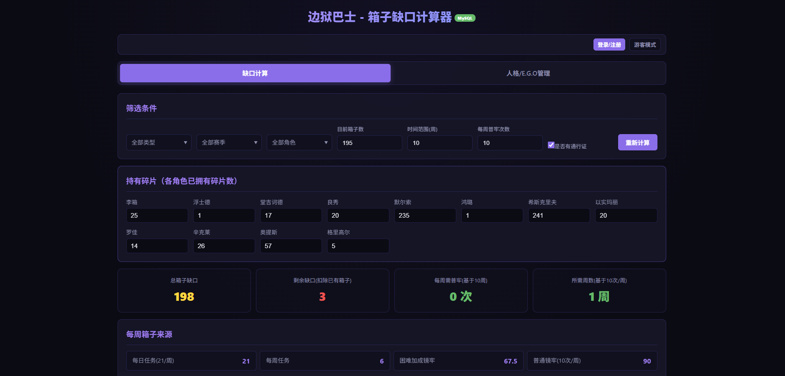
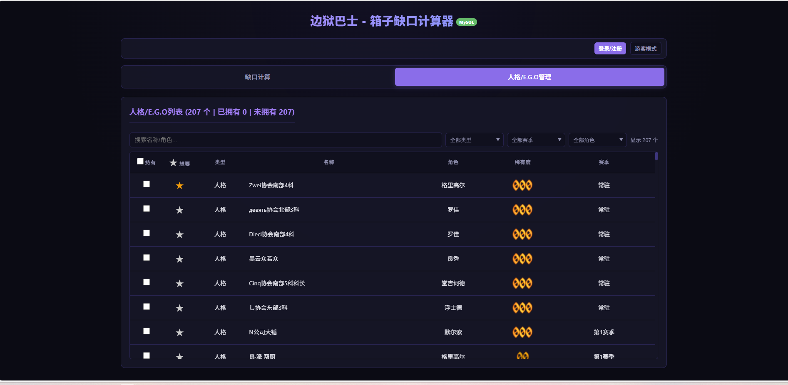
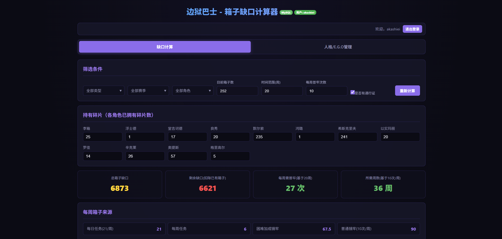

# 边狱巴士箱子缺口计算器 (LimbusCompanyBoxCalculate)

一款专为游戏《边狱公司》(Limbus Company) 玩家打造的工具，用于计算获取目标人格所需的碎片和箱子数量。

数据库暂时不会自动添加任何人格/E.G.O的数据，需要手动添加到数据库或创建admin账号进行添加（请注意）

项目基本上使用CodeBuddy完成，实际上为使用CodeBuddy测试是否能完成一个独立项目。

## 效果图








## 功能介绍

- **人格管理**: 查看和管理游戏中各角色的不同人格
- **碎片计算**: 根据已有人格和目标人格计算所需碎片数量
- **箱子缺口**: 计算获取所有目标人格需要的箱子数量
- **周收益计算**: 估算每周可获得的箱子数量
- **时间规划**: 根据游戏时间计算所需周数
- **用户系统**: 支持注册登录，保存个人数据
- **游客模式**: 无需登录即可快速计算

## 技术栈

- **前端**: React 19 + Vite + TypeScript
- **后端**: Python Flask + MySQL
- **数据库**: MySQL 8.0+

## 项目结构

```
LimbusCompanyBoxCalculate/
├── server.py              # Flask 后端服务
├── requirements.txt       # Python 依赖
├── .env.example          # 环境变量示例
├── data.json             # 初始数据
├── frontend/             # React 前端项目
│   ├── src/             # 前端源代码
│   ├── public/          # 静态资源
│   └── package.json    # 前端依赖
└── readme/              # 效果截图
```

## 安装步骤

### 1. 克隆项目

```bash
git clone <repository-url>
cd LimbusCompanyBoxCalculate
```

### 2. 配置数据库

#### 导入环境变量

复制 `.env.example` 为 `.env` 并配置数据库连接：

```bash
cp .env.example .env
```

编辑 `.env` 文件，填入您的数据库信息：

```env
DB_HOST=localhost
DB_PORT=3306
DB_USER=your_username
DB_PASSWORD=your_password
DB_DATABASE=limbus_database
DB_CHARSET=utf8mb4
```

### 3. 安装后端依赖

```bash
# 创建虚拟环境（推荐）
python -m venv venv

# 激活虚拟环境
# Windows:
venv\Scripts\activate
# Linux/Mac:
source venv/bin/activate

# 安装依赖
pip install -r requirements.txt
```

### 4. 安装前端依赖

```bash
cd frontend
npm install
```

## 启动项目

### 启动后端

```bash
python server.py
```

后端服务将在 `http://localhost:5000` 启动。

### 启动前端

```bash
cd frontend
npm run dev
```

前端应用将在 `http://localhost:5173` 启动。

## 使用示例

### 1. 基础计算

1. 在前端页面选择你的筛选条件（人格类型、赛季）
2. 设置当前持有的碎片数量
3. 点击计算获取缺口信息

### 2. 游客模式

无需注册登录，直接在页面选择已有人格，系统会计算缺口。

### 3. 注册账号

1. 点击注册按钮
2. 输入用户名和密码
3. 登录后可保存个人数据

### 4. 设置admin账号

创建任意账号后，需要到user数据库中，将对应用户的role字段的内容改成`admin`

### API 接口说明

| 接口 | 方法 | 说明 |
|------|------|------|
| `/api/items` | GET | 获取所有人格列表 |
| `/api/calculate` | POST | 计算碎片/箱子缺口 |
| `/api/settings` | GET/POST | 获取/保存全局设置 |
| `/api/auth/register` | POST | 用户注册 |
| `/api/auth/login` | POST | 用户登录 |
| `/api/user/items` | GET/PUT | 获取/更新用户人格状态 |
| `/api/user/fragments` | GET/PUT | 获取/更新用户碎片持有 |
| `/api/user/settings` | GET/PUT | 获取/更新用户设置 |
| `/api/user/calculate` | POST | 用户计算（需登录） |
| `/api/guest/calculate` | POST | 游客计算 |

## 配置参数说明

| 参数 | 说明 | 默认值 |
|------|------|--------|
| `type_filter` | 人格类型筛选 | ALL |
| `season_filter` | 赛季筛选 | ALL |
| `character_filter` | 角色筛选 | ALL |
| `time_weeks` | 计划周数 | 10 |
| `weekly_mirror_count` | 每周普通镜像次数 | 10 |
| `current_boxes` | 当前持有箱子数 | 0 |
| `has_pass` | 是否有战斗通行证 | true |
